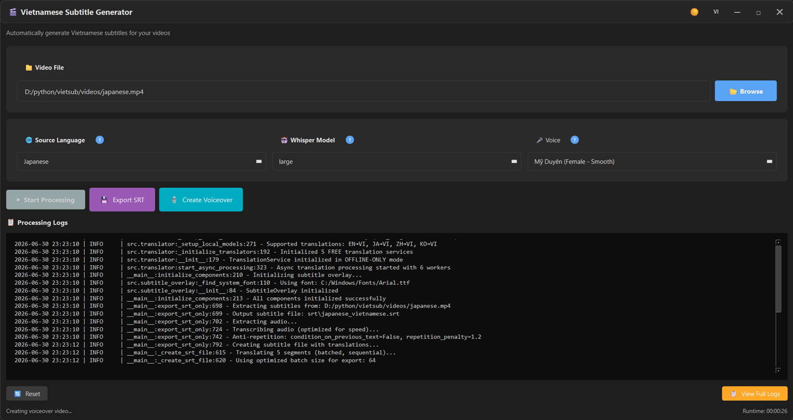

# Offline Vietnamese Subtitle Generator

100% offline video subtitle generation system powered by faster-whisper and local translation models. No internet connection required after initial setup.

## Features

- **Offline Speech Recognition**: faster-whisper-based accurate transcription (100% local)
- **Advanced Translation**: NLLB-200-distilled-600M for high-quality translation (max 1024 tokens)
- **Auto Chunk Processing**: Automatically splits long texts to handle videos >3 hours
- **Smart Fallback**: Multi-layer fallback (NLLB → opus-mt → Argos) ensures reliability
- **Video Processing**: Add Vietnamese subtitles to video files with timing synchronization
- **Voice-Over Generation**: Create videos with natural Vietnamese voice-over (TTS) from subtitles
- **Subtitle Export**: Export standalone .srt subtitle files without creating video
- **Multi-language Support**: EN, JA, ZH, KO, TH, ID → VI (direct translation)
- **Modern GUI**: Easy-to-use PySide6 interface with progress tracking and pause/resume
- **100% Free & Open Source**: No API keys, subscriptions, or rate limits
- **Complete Privacy**: All processing done locally on your machine

## Demo



## Requirements

- Python 3.12.6 ([download here](https://www.python.org/downloads/release/python-3126/) - Windows installer (64-bit))
- FFmpeg ([download here](https://www.gyan.dev/ffmpeg/builds/) - ffmpeg-git-essentials.7z)
- espeak-ng (optional): Text-to-Speech engine for TTS backup ([download here](https://github.com/espeak-ng/espeak-ng/releases))
- No internet connection required (after installing dependencies)

## Installation

1. **Clone and navigate to project directory**

   ```bash
   cd vietsub
   python -m venv venv
   ```

2. **Activate virtual environment**

   ```bash
   source venv/Scripts/activate
   ```

   To deactivate:

   ```bash
   deactivate
   ```

3. **Install dependencies**

   ```bash
   pip install -r requirements.txt
   ```

## Usage

### GUI Mode (Recommended)

Launch the modern PySide6 interface with drag-and-drop support:

```bash
python app_tk.py
```

or

```bash
./run.sh
```

Features:

- Select video file via file browser or drag-and-drop
- Choose source language: **English, Japanese, Chinese (Simplified), Korean, Thai, Indonesian**
- Real-time progress tracking with runtime display
- Pause/Resume/Stop/Reset controls
- **Two processing modes:**
  - **Start Processing**: Creates video with embedded subtitles (saved to Downloads)
  - **Export SRT**: Generates subtitle file only (.srt format, saved to Downloads)
- Output automatically saved to Downloads folder with auto-open
- View logs and download SRT file

### Command Line Mode

**Create video with subtitles** (English source, default):

```bash
python main.py --video --input videos/english.mp4 --output videos/output_with_subtitles_en.mp4
# With custom model: add --model {tiny,base,small,medium,large}
python main.py --video --model base --input videos/english.mp4 --output videos/output_with_subtitles_en.mp4
```

**Create video with subtitles** (other languages):

```bash
# Japanese
python main.py --video --language ja --input videos/japanese.mp4 --output videos/output_ja.mp4

# Chinese (Simplified)
python main.py --video --language zh --input videos/chinese.mp4 --output videos/output_zh.mp4

# Korean
python main.py --video --language ko --input videos/korean.mp4 --output videos/output_ko.mp4

# Thai
python main.py --video --language th --input videos/thai.mp4 --output videos/output_th.mp4

# Indonesian
python main.py --video --language id --input videos/indonesian.mp4 --output videos/output_id.mp4

# With custom model (add to any command above):
python main.py --video --model small --language ja --input videos/japanese.mp4 --output videos/output_ja.mp4
```

**Legacy flag (still supported):**

```bash
# Old way (deprecated but still works)
python main.py --video --jp --input videos/japanese.mp4 --output videos/output.mp4
```

**Export subtitle file only** (.srt format, saved to /srt directory):

```bash
# English (default)
python main.py --export-srt --input videos/english.mp4

# Other languages
python main.py --export-srt --language ja --input videos/japanese.mp4
python main.py --export-srt --language zh --input videos/chinese.mp4
python main.py --export-srt --language ko --input videos/korean.mp4

# With custom model (add --model {tiny,base,small,medium,large}):
python main.py --export-srt --model base --language ja --input videos/japanese.mp4
```

**Generate Video with Voice-Over** (Vietnamese TTS):

```bash
# Basic usage (auto-generates subtitles first)
python main.py --voiceover --input videos/english.mp4

# With existing SRT file
python main.py --voiceover --input videos/english.mp4 --srt subtitles.srt

# Custom output path
python main.py --voiceover --input videos/english.mp4 --output videos/voiceover.mp4
```

**Available language codes:**

- `en` - English (default)
- `ja` - Japanese (日本語)
- `zh` - Chinese Simplified (中文简体)
- `ko` - Korean (한국어)
- `th` - Thai (ไทย)
- `id` - Indonesian (Bahasa Indonesia)

**Available model sizes** (optional, default: base):

- `tiny` - Fastest (~0.5 min/hour), lowest accuracy
- `base` - Recommended (~1 min/hour), good balance
- `small` - Better accuracy (~2 min/hour)
- `medium` - High quality (~5 min/hour)
- `large` - Best accuracy (~10 min/hour), slowest

Full path example:

```bash
python main.py --video --language ja --input "/d/video_recording/test/japanese.mp4" --output "videos/output.mp4"
```

Note: All processing is done 100% offline. Internet is not required after dependencies are installed.

## Configuration

Edit `config/config.yaml` to customize:

- **Whisper model size**: tiny, base, small, medium, large (affects accuracy vs speed)
- **Translation workers**: Number of parallel threads for video mode (default: 6, optimal for most CPUs)
  - 6 workers: Best for 4-8 core CPUs (recommended)
  - 8 workers (`export_translation_workers`): For SRT export mode with higher throughput
  - Batch processing automatically optimizes throughput
- **Cache size**: Translation cache (default: 1000 entries, LRU eviction)
- **Batch size**: `translation_batch_size: 32` (video mode), `export_translation_batch_size: 64` (export mode)
- **Subtitle appearance**: Font, size, color, position, background opacity
- **Video output**: Codec, bitrate, FPS settings
- All settings optimized for offline processing with batch translation

## Project Structure

```
vietsub/
├── app_tk.py                # PySide6 GUI interface
├── main.py                  # CLI entry point & orchestrator
├── AGENTS.md                # Agent instructions for AI assistants
├── run.sh                   # Convenience launcher script
├── requirements.txt         # Dependencies
├── LICENSE                  # MIT License
├── .gitignore
├── .gitattributes
├── .github/
│   └── prompts/             # Chat commands (/ai-commit, /code-review)
│       ├── ai-commit.prompt.md
│       └── code-review.prompt.md
├── config/
│   ├── config.yaml          # Central configuration
│   └── user_preferences.json# User language/theme preferences
├── images/
│   └── demo.png             # Screenshot
├── lang/
│   ├── en.json              # English UI localization
│   └── vi.json              # Vietnamese UI localization
├── src/
│   ├── audio_processor.py   # Real-time mic capture (PyAudio)
│   ├── subtitle_overlay.py  # Subtitle rendering (OpenCV)
│   └── translator.py        # Translation engine + cache (NLLB/opus-mt/Argos)
├── srt/                     # Generated subtitle output
├── videos/                  # Sample videos
└── logs/                    # Application logs
```

## Dependencies

- `faster-whisper` - Speech recognition (offline, CTranslate2 backend)
- `transformers` - Local neural translation models (NLLB, opus-mt)
- `argostranslate` - Offline statistical translation (fallback)
- `PySide6` - Modern GUI framework
- `opencv-python` - Video processing & subtitle overlay
- `moviepy` - Video/audio manipulation (FFmpeg wrapper)
- `torch` - Deep learning framework (CPU/CUDA support)
- `pyyaml` - Configuration parsing
- `loguru` - Logging
- `tqdm` - Progress bars
- `vieneu` - Vietnamese TTS voiceover (VieNeu v3 Turbo)
- `pydub` - Audio processing
- `keyboard` - Global hotkey support

## Troubleshooting

**First-time setup slow**: Local translation models will be downloaded automatically on first run (one-time only)

**Translation quality issues**:

- Install Argos Translate language packages: `argostranslate-package-updater`
- Models are downloaded automatically to `~/.cache/huggingface/` and `~/.local/share/argos-translate/`

**Performance issues**:

- Use smaller Whisper model (`tiny` or `base`) in `config/config.yaml` for faster processing
- Adjust `translation_workers` (default: 6) based on your CPU cores
- Recommended: 6 workers for 4-8 cores, 8 workers (`export_translation_workers`) for 8+ cores

**Processing paused/stuck**:

- Use Stop button to cancel and Reset to start over
- Check logs for detailed error messages

**FFmpeg errors**:

- Ensure FFmpeg is installed and in system PATH
- Download from: https://www.gyan.dev/ffmpeg/builds/

## Performance Tips

- **NLLB Model**: Uses facebook/nllb-200-distilled-600M for high-quality translation with 1024 token support
- **Batch Translation**: Optimized batch processing with configurable size (32 for video mode, 64 for export mode)
- **Auto Chunking**: Automatically splits long texts (>1024 tokens) for videos >3 hours
- **Smart Caching**: Automatic LRU caching of translations (1000 entries) reduces redundant processing
- **Parallel Processing**: Multi-threaded translation with optimized lock scope for maximum throughput
- **CPU Usage**: Translation workers utilize multiple CPU cores efficiently (default: 6 workers, 8 for export)
- **Memory**: Models require ~2-4GB RAM (NLLB: ~1.2GB, Whisper varies by size)
- **First Run**: Allow 5-10 minutes for automatic model downloads (one-time setup)
- **Subsequent Runs**: Fully offline with no internet dependency
- **Speed**: Process ~1 minute of video per minute on modern CPUs (base Whisper model)

## Privacy & Offline Benefits

✅ **100% Local Processing** - No data sent to external servers  
✅ **No Rate Limits** - Process unlimited videos without restrictions  
✅ **No API Costs** - Completely free to use  
✅ **Works Offline** - Process videos anywhere without internet  
✅ **Private** - Your video content never leaves your machine

## License

This project is licensed under the MIT License - see the [LICENSE](LICENSE) file for details.

---

**Maintainer**: quanghuybest2k2  
**Repository**: [vietsub](https://github.com/quanghuybest2k2/vietsub)
